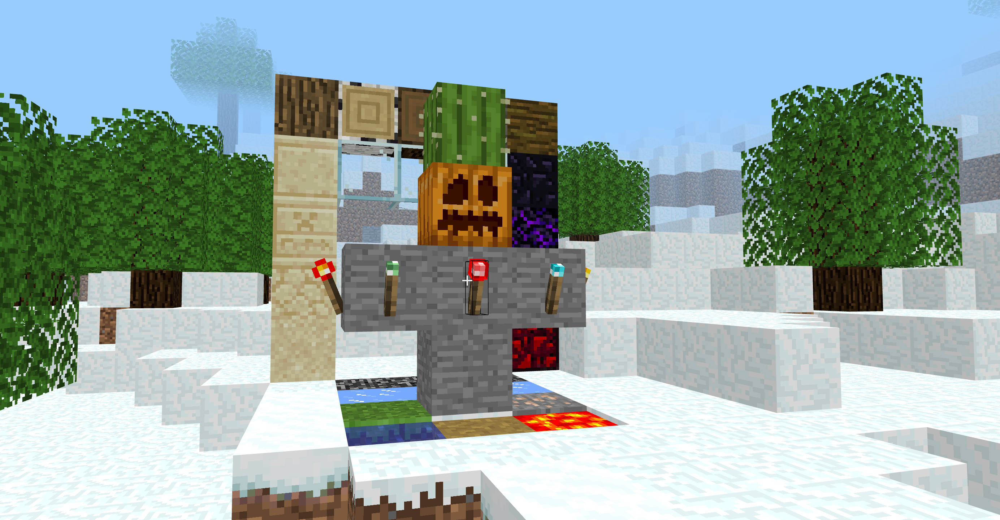
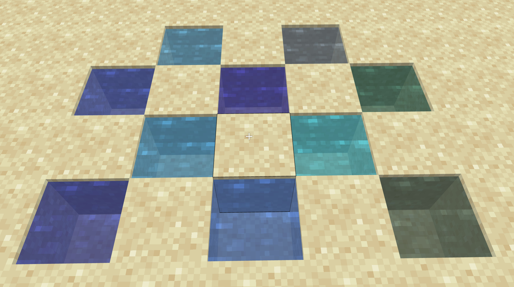

### Screenshot




### Build

```sh
moon build --target-dir ./dist
```

### Run

```sh
miniserve dist --index index.html --port 8089 --media-type image --upload-files assets
```

### Entity glTF (experimental)

You can load entity models by providing `dist/assets/models/entities.json`:

```json
[
  {
    "id": "pig_0",
    "url": "./assets/models/pig.gltf",
    "texture": "./assets/images/entity/pig.png",
    "materialTextures": {
      "Body": "./assets/images/entity/pig.png"
    },
    "position": [8, 70, 8],
    "rotation": [0, 0, 0, 1],
    "scale": [1, 1, 1],
    "animation": "Walk",
    "speed": 1.0,
    "loop": true
  }
]
```

You can also bypass the manifest and inject at runtime:

```js
window.mcGltfEntities = [
  {
    url: "./assets/models/zombie.gltf",
    texture: "./assets/images/entity/zombie.png",
    animation: "animation.zombie.walk",
    position: [0, 68, 0],
  },
];
```

Optional manifest path override:

```js
window.mcGltfEntityManifestUrl = "./assets/models/my-entities.json";
```

Runtime API (available after renderer init):

```js
// by entity id from config, or numeric index
await window.mcGltfEntityApi.setAnimation("zombie_0", "animation.zombie.walk");
await window.mcGltfEntityApi.setTexture("zombie_0", "./assets/images/entity/zombie.png");

// disable animation
await window.mcGltfEntityApi.setAnimation("zombie_0", "none");
```

MoonBit-side entity API:

- `@entity.install_demo_entities()` publishes `mcGltfEntities`
- `@entity.start_zombie_animation_demo()` starts the zombie animation cycle
- `@entity.set_animation(id, clip)` / `@entity.set_texture(id, path)` call JS runtime API from MBT

Observable demo (with animation):

```js
// moonbit `main` now auto-starts zombie animation demo by default.
// manual JS controls are still available:
await window.mcStartEntityAnimationDemo("zombie_0", 1500);
window.mcStopEntityAnimationDemo();
```

Current implementation is aimed at Blockbench-exported glTF:

- static mesh nodes
- node TRS animation channels (`translation` / `rotation` / `scale`)
- `STEP` / `LINEAR` interpolation
- `CUBICSPLINE` is currently downgraded to value-key linear blending
- `.gltf` (external textures) and `.glb` (embedded image bufferView) texture loading
- entity textures default to `NEAREST` sampling (gltf sampler can override)
- if a model has no embedded texture reference, specify `texture`, `textures`,
  or `materialTextures`
  in config explicitly
- `materialTextures` supports material-name overrides (recommended for multi-skin assets)
- entities missing both embedded texture and config texture are skipped
- `textures` supports material-index overrides (array or object map); object
  keys that are not numeric are treated as material names
- `animation: false` or `animation: "none"` disables clip autoplay
- runtime API: `setAnimation(entityId, clip)` and `setTexture(entityId, path)`

### World Type

You can switch world type by editing `client.mbt`:

```mbt
let world = @level.World::new(world_type=@level.WorldType::Infinite)
```

Replace `Infinite` with one of:

- `@level.WorldType::Infinite`
- `@level.WorldType::Finite`
- `@level.WorldType::Flat`
- `@level.WorldType::PreClassic`

## Progress

### Implemented

- World types:
  - `Infinite` (multi-biome terrain, oceans, desert lakes, trees)
  - `Finite` (independent terrain profile with lower mountains, biome trees, `nether_spire` placement at world origin)
  - `PreClassic` (pre-classic style terrain/materials, cave/water profile, tree generation enabled)
  - `Flat` (default: `"grass", "dirt", "dirt", "bedrock"`)
- Terrain generation:
  - Biome-driven surface and underground generation
  - Separate logic for `Infinite` / `Finite` / `PreClassic`
  - Ore distribution in modern-style worlds
- Rendering / gameplay core:
  - Chunk generation and meshing pipeline
  - Block selection / raycast and placement
  - Basic lighting and world interaction loop

### Next Steps

- Anything interesting! 
  - We welcome all PRs, even those that do not pertain to the design of Minecraft. 
- Improve biome transition blending near borders (reduce abrupt visual seams)
- Add more structure / feature variety beyond current tree + nether spire coverage
- Continue optimizing chunk update / light update hot paths under frequent block edits
- Expand pre-classic specific content (materials / structure presets) for stronger era identity

## Asset Copyright Notice (Minecraft EULA)

- Files under `dist/assets` may contain textures or other resources derived from Minecraft.
- Minecraft and all related assets and intellectual property are owned by Mojang Studios / Microsoft.
- This project is an unofficial fan project and is not affiliated with, endorsed by, or sponsored by Mojang Studios or Microsoft.
- Use and redistribution of these assets must comply with the Minecraft EULA.
- If you plan to publish or commercialize this project, replace `dist/assets` resources with original or properly licensed assets.

Reference: https://www.minecraft.net/eula
