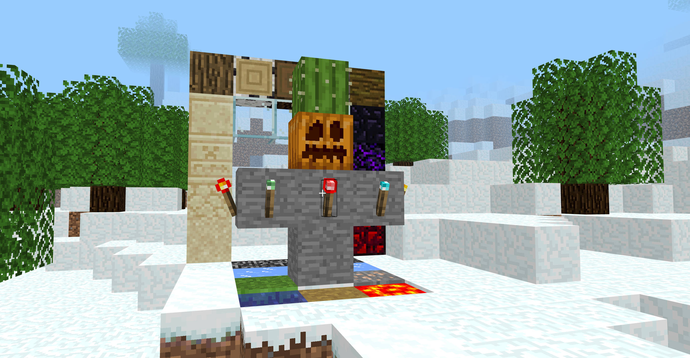
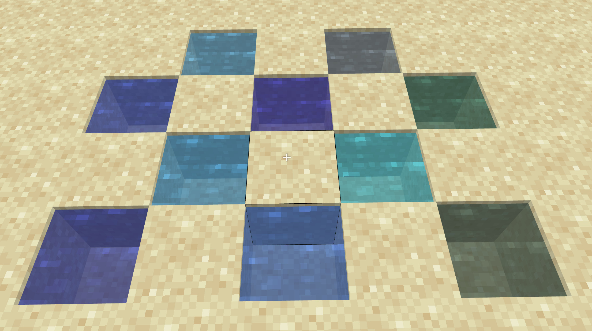

### Screenshot





### Build

```sh
# npm install # once
npm run build
```

### Run

```sh
npm run serve
```

### World Type

The `launchGame` browser entry point selects the world type (`main.mbt`):

```js
launchGame(seed, "Infinite", height, saveText)
```

Supported play-world names:

- `Infinite`
- `Finite`
- `Flat`
- `PreClassic`

## Code structure

MoonBit owns world generation, simulation, mesh preparation, and glTF rendering.
`client/` exposes browser APIs; `web/` contains browser integration and assets.
`chunk/`, `level/`, `player/`, `entity/`, and `mob/` own runtime behavior.
`block/`, `item/`, `mesh/`, and `gltf/` own content and rendering rules.

## Asset Copyright Notice (Minecraft EULA)

- Files under `web/assets` may contain textures or other resources derived from Minecraft.
- Minecraft and all related assets and intellectual property are owned by Mojang Studios / Microsoft.
- This project is an unofficial fan project and is not affiliated with, endorsed by, or sponsored by Mojang Studios or Microsoft.
- Use and redistribution of these assets must comply with the Minecraft EULA.
- If you plan to publish or commercialize this project, replace `web/assets` resources with original or properly licensed assets.

Reference: https://www.minecraft.net/eula

## Acknowledgments

- Zhuowei Zhang
